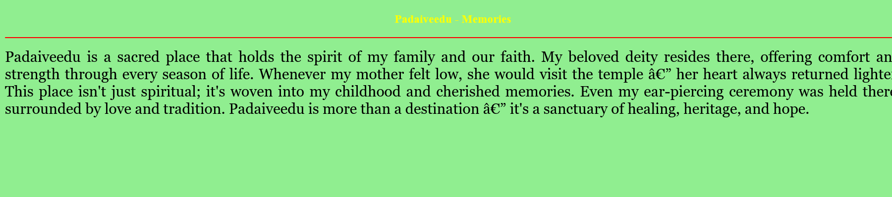
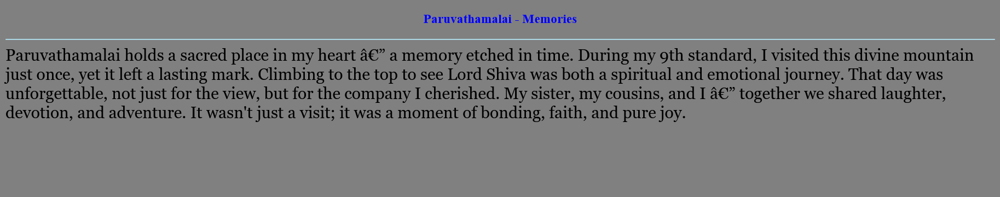

# Ex04 Places Around Me
## Date: 29/09/2025

## AIM
To develop a website to display details about the places around my house.

## DESIGN STEPS

### STEP 1
Create a Django admin interface.

### STEP 2
Download your city map from Google.

### STEP 3
Using ```<map>``` tag name the map.

### STEP 4
Create clickable regions in the image using ```<area>``` tag.

### STEP 5
Write HTML programs for all the regions identified.

### STEP 6
Execute the programs and publish them.

## CODE
```
map.html

<!-- Image Map Generated by http://www.image-map.net/ -->
<html>
<body>
 

<map name="image-map">
    <area target="_top" alt="Polur" title="Polur" href="Polur.html" coords="568,292,63" shape="circle">
    <area target="_top" alt="Tiruvannamalai" title="Tiruvannamalai" href="Tiruvannamalai.html" coords="606,654,412,562" shape="rect">
    <area target="_top" alt="Parvadhamalai" title="Parvadhamalai" href="Paruvathamalai.html" coords="342,334,485,419" shape="rect">
    <area target="_top" alt="Arani" title="Arani" href="Arni.html" coords="739,114,47" shape="circle">
    <area target="_top" alt="Padaiveedu" title="Padaiveedu" href="Padaiveedu.html" coords="508,90,596,149" shape="rect">
</img>
</map>
</body>
</html>

Polur.html

<html>
<head>
<title>My City</title>
</head>
<body bgcolor="lightgreen">
<h1 align="center">
<font color="white"><b></b></font> 
</h1>
<h3 align="center">
<font color="red"><b>Polur - Memories</b></font>
</h3>
<hr size="3" color="red"
<p align="justify">
<font face="Georgia" size="5">
Polur is more than just a town to me — it's where my journey truly began. From 6th to 12th standard, I walked its streets, studied in its classrooms, and grew with its rhythm. Every corner holds a memory, every breeze whispers a moment I once lived. It's the place where many of my “firsts” happened — my first friends, my first dreams, my first victories. No matter where life takes me, Polur remains etched in my heart like a timeless melody. I can never forget this town — it shaped me, inspired me, and gave me roots to fly.
</font>
</p>
</body>
</html>

Padaiveedu.html

<html>
<head>
<title>My City</title>
</head>
<body bgcolor="lightgreen">
<h1 align="center">
<font color="white"><b></b></font> 
</h1>
<h3 align="center">
<font color="yellow"><b>Padaiveedu - Memories</b></font>
</h3>
<hr size="3" color="red">
<p align="justify">
<font face="Georgia" size="5">
Padaiveedu is a sacred place that holds the spirit of my family and our faith. My beloved deity resides there, offering comfort and strength through every season of life. Whenever my mother felt low, she would visit the temple — her heart always returned lighter. This place isn't just spiritual; it's woven into my childhood and cherished memories. Even my ear-piercing ceremony was held there, surrounded by love and tradition. Padaiveedu is more than a destination — it's a sanctuary of healing, heritage, and hope.
</font>
</p>
</body>
</html>

Paruvathamalai.html

<html>
<head>
<title>My City</title>
</head>
<body bgcolor="Gray">
<h1 align="center">
<font color="white"><b></b></font> 
</h1>
<h3 align="center">
<font color="blue"><b>Paruvathamalai - Memories</b></font>
</h3>
<hr size="3" color="lightblue"
<p align="justify">
<font face="Georgia" size="5">
Paruvathamalai holds a sacred place in my heart — a memory etched in time. During my 9th standard, I visited this divine mountain just once, yet it left a lasting mark. Climbing to the top to see Lord Shiva was both a spiritual and emotional journey. That day was unforgettable, not just for the view, but for the company I cherished. My sister, my cousins, and I — together we shared laughter, devotion, and adventure. It wasn't just a visit; it was a moment of bonding, faith, and pure joy.
</font>
</p>
</body>
</html>

Tiruvannamalai.html

<html>
<head>
<title>My City</title>
</head>
<body bgcolor="Cyan">
<h1 align="center">
<font color="white"><b></b></font> 
</h1>
<h3 align="center">
<font color="blue"><b>Tiruvannamalai--Memories</b></font>
</h3>
<hr size="3" color="brown">
<p align="justify">
<font face="Georgia" size="5">
Tiruvannamalai stands tall, sacred and serene, beneath the gaze of Arunachaleshwar. I've walked its paths just twice, yet its spirit lingers like a quiet chant in my heart. But for my sister, it's a canvas of countless memories, painted with devotion and joy. She returned often, drawn by something deeper than prayer — a rhythm only she understood. In its shadow, laughter bloomed, and moments were shared that words dare not name. Her happiness echoed through its streets — and that joy made it my favorite place too.
</font>
</p>
</body>
</html>

Arni.html

<html>
<head>
<title>My City</title>
</head>
<body bgcolor="orange">
<h1 align="center">
<font color="white"><b></b></font> 
</h1>
<h3 align="center">
<font color="lightgreen"><b>Arni--Memories</b></font>
</h3>
<hr size="3" color="red"
<p align="justify">
<font face="Georgia" size="5">
Arani is more than a town — it's the crossroad of my journeys and the keeper of my smiles. Every path I've taken seems to pass through its heart, guiding me gently toward new beginnings. There, in the quiet hum of everyday life, I've felt unexpected warmth bloom on my cheeks. As if the wind carried whispers meant only for me, arriving at just the right moment. Some memories are too tender to name, yet they live in the rhythm of that place. Arani holds them all — my blushes, my pauses, and the silent magic of connection.
</font>
</p>
</body>
</html>
```

## OUTPUT






## RESULT
The program for implementing image maps using HTML is executed successfully.
